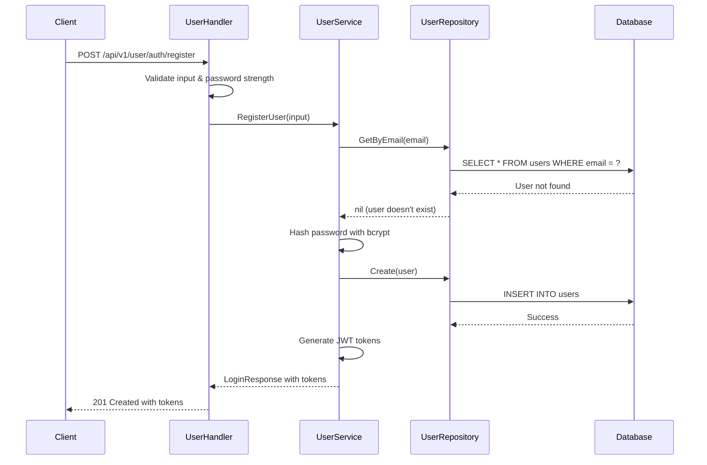
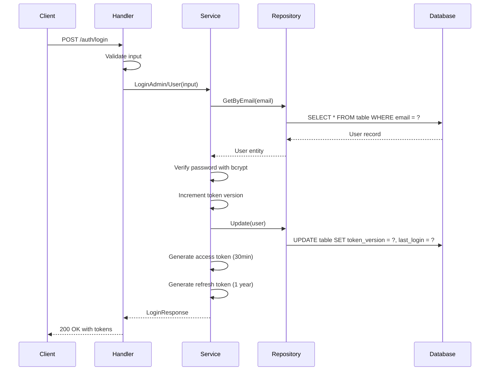
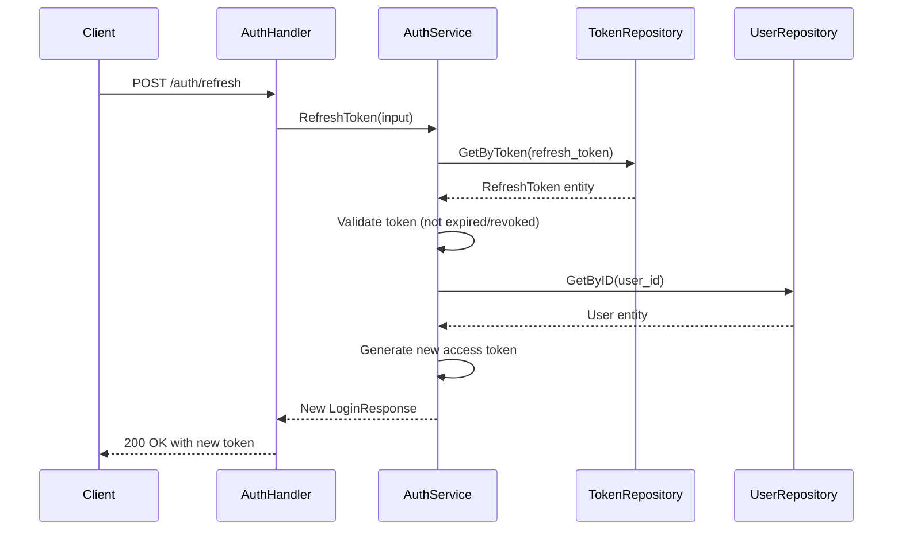

# User Authentication System - Clean Architecture

This document explains the authentication system implementation using Clean Architecture principles.

## 🏗️ Architecture Overview

The authentication system is built with Clean Architecture, separating concerns across different layers:

```
Authentication Flow:
┌─────────────────┐    ┌──────────────────┐    ┌─────────────────┐
│   HTTP Layer    │    │ Application Layer│    │  Domain Layer   │
│                 │    │                  │    │                 │
│ • AuthHandler   │───▶│ • AuthService    │───▶│ • Admin Entity  │
│ • UserHandler   │    │ • UserService    │    │ • User Entity   │
│ • Middleware    │    │ • DTOs           │    │ • Repositories  │
└─────────────────┘    └──────────────────┘    └─────────────────┘
         │                       │                       │
         ▼                       ▼                       ▼
┌─────────────────┐    ┌──────────────────┐    ┌─────────────────┐
│Infrastructure   │    │   Ports/Interfaces│    │ Database Layer  │
│                 │    │                  │    │                 │
│ • TokenRepo     │    │ • TokenRepository│    │ • GORM Models   │
│ • AdminRepo     │    │ • AdminRepository│    │ • Migrations    │
│ • UserRepo      │    │ • UserRepository │    │ • Transactions  │
└─────────────────┘    └──────────────────┘    └─────────────────┘
```

## 🔐 Authentication Domains

The system supports three distinct authentication domains:

### 1. **Admin Authentication**
- **Purpose**: Administrative users who manage the dashboard
- **Endpoints**: `/api/v1/auth/*`
- **Entity**: `internal/domain/auth/entity/admin.go`
- **Handler**: `internal/interfaces/http/handlers/auth_handler.go`

### 2. **User Authentication**
- **Purpose**: Regular application users
- **Endpoints**: `/api/v1/user/auth/*`
- **Entity**: `internal/domain/user/entity/user.go`
- **Handler**: `internal/interfaces/http/handlers/user_handler.go`

### 3. **Device Authentication**
- **Purpose**: IoT devices and API clients
- **Endpoints**: `/api/v1/auth/device`
- **Entity**: `internal/domain/device/entity/device.go`
- **Handler**: `internal/interfaces/http/handlers/device_handler.go`

## 🔄 Authentication Flow

### Registration Process (Users Only)



### Login Process (All User Types)



### Token Refresh Process



## 🛡️ Security Implementation

### Password Security

**Location**: `utils/password.go`

```go
// Strong password requirements
func IsStrongPassword(password string) (bool, string) {
    // Minimum 12 characters (configurable via SECURITY_MIN_PASSWORD_LENGTH)
    // At least one lowercase letter
    // At least one uppercase letter  
    // At least one digit
    // At least one special character
    // No common passwords
    // No sequential characters
}
```

**Configuration**:
```env
SECURITY_MIN_PASSWORD_LENGTH=12  # Configurable minimum length
```

### Token Security

#### JWT Structure
```json
{
  "user_id": 123,
  "user_type": "admin|user|device",
  "token_version": 5,
  "token_type": "access",
  "exp": 1725801600,
  "iat": 1725799800
}
```

#### Token Versioning
- Each user has a `token_version` field
- Incremented on login, logout, password change
- Invalid tokens are rejected if version doesn't match
- Enables immediate revocation of all user sessions

**Implementation**:
```go
// In AuthMiddleware
if tokenVersion != user.TokenVersion {
    return errors.New("token has been revoked")
}
```

### Refresh Token Management

**Entity**: `internal/domain/auth/entity/token.go`
```go
type RefreshToken struct {
    ID        uint
    Token     string    // JWT refresh token
    UserID    uint      // Reference to user
    UserType  string    // "admin", "user", "device"
    ExpiresAt time.Time // 1 year from creation
    IsRevoked bool      // Manual revocation
}
```

**Features**:
- Stored in database for revocation capability
- One-time use (can be configured)
- Automatic cleanup of expired tokens
- User type isolation

## 🚨 Rate Limiting

**Implementation**: `internal/interfaces/http/middleware/auth.go`

```go
type IPLimiter struct {
    limiter    *rate.Limiter
    lastAccess time.Time
}
```

**Configuration**:
```env
RATE_LIMIT_REQUESTS_PER_MINUTE=60
RATE_LIMIT_PATHS=/api/v1/auth/login,/api/v1/user/auth/register
RATE_LIMIT_CLEANUP_MINUTES=5
RATE_LIMIT_INACTIVE_MINUTES=20
```

**Features**:
- IP-based limiting
- Configurable paths
- Automatic cleanup of inactive limiters
- Memory-efficient with goroutine cleanup

## 🔒 Middleware Stack

### AuthMiddleware
**Location**: `internal/interfaces/http/middleware/auth.go`

```go
func AuthMiddleware() gin.HandlerFunc {
    // 1. Extract Bearer token
    // 2. Parse JWT and validate signature
    // 3. Check token expiration
    // 4. Verify user exists in database
    // 5. Validate token version
    // 6. Set user context for handlers
}
```

### Role-Based Middleware

```go
// AdminRequired - ensures user_type = "admin"
func AdminRequired() gin.HandlerFunc

// UserRequired - ensures user_type = "user"  
func UserRequired() gin.HandlerFunc

// SelfOrAdminRequired - user can access own resource or admin can access any
func SelfOrAdminRequired() gin.HandlerFunc
```

## 📁 Layer Responsibilities

### Domain Layer (`internal/domain/`)

**Entities**:
- `auth/entity/admin.go` - Admin user representation
- `user/entity/user.go` - Regular user representation
- `device/entity/device.go` - IoT device representation
- `auth/entity/token.go` - Refresh token representation

**Repository Interfaces**:
- `auth/repository/admin.go` - Admin data operations
- `user/repository/user.go` - User data operations
- `auth/repository/token.go` - Token data operations

### Application Layer (`internal/application/`)

**Services (Use Cases)**:
- `services/auth_service.go` - Admin authentication logic
- `services/user_service.go` - User management logic
- `services/device_service.go` - Device management logic

**DTOs**:
- `dto/auth.go` - Authentication request/response objects
- `dto/user.go` - User management DTOs

### Infrastructure Layer (`internal/infrastructure/`)

**Repository Implementations**:
- `database/admin_repository.go` - GORM admin repository
- `database/user_repository.go` - GORM user repository
- `database/token_repository.go` - GORM token repository

### Interface Layer (`internal/interfaces/http/`)

**Handlers**:
- `handlers/auth_handler.go` - Admin auth endpoints
- `handlers/user_handler.go` - User auth endpoints
- `handlers/device_handler.go` - Device auth endpoints

**Middleware**:
- `middleware/auth.go` - Authentication and authorization
- `middleware/user.go` - User-specific middleware

## 🔧 Configuration

### Environment Variables

```env
# JWT Configuration
JWT_SECRET=your_strong_secret_key_here
JWT_EXPIRY_MINUTES=30

# Security
SECURITY_MIN_PASSWORD_LENGTH=12

# Rate Limiting
RATE_LIMIT_REQUESTS_PER_MINUTE=60
RATE_LIMIT_PATHS=/api/v1/auth/login,/api/v1/user/auth/register
RATE_LIMIT_CLEANUP_MINUTES=5
RATE_LIMIT_INACTIVE_MINUTES=20

# Database
DB_USER=postgres
DB_PASSWORD=your_password
DB_NAME=dashboard
```

### Dependency Injection

**Container**: `internal/interfaces/http/container.go`

```go
type Container struct {
    // Services
    authService    *services.AuthService
    userService    *services.UserApplicationService
    deviceService  *services.DeviceApplicationService
    
    // Handlers
    AuthHandler    *handlers.AuthHandler
    UserHandler    *handlers.UserHandler
    DeviceHandler  *handlers.DeviceHandler
}
```

## 🧪 Testing Strategy

### Unit Tests
```bash
# Domain layer tests
go test ./internal/domain/auth/... -v
go test ./internal/domain/user/... -v

# Application layer tests  
go test ./internal/application/services/... -v

# Infrastructure layer tests
go test ./internal/infrastructure/database/... -v
```

### Integration Tests
```bash
# HTTP handler tests
go test ./internal/interfaces/http/handlers/... -v

# End-to-end API tests
go test ./tests/auth_test.go -v
```

### Test Database Setup
```go
// Use separate test database
func setupTestDB() *gorm.DB {
    db := setupInMemoryDB() // SQLite in-memory
    db.AutoMigrate(&entity.Admin{}, &entity.User{}, &entity.RefreshToken{})
    return db
}
```

## 🚀 Performance Considerations

### Database Optimization
- Connection pooling configured in `db/db.go`
- Proper indexing on email fields
- Token cleanup jobs for expired refresh tokens

### Memory Management
- IP limiter cleanup goroutine
- Connection pool limits
- Graceful shutdown handling

### Security Best Practices
- Environment-based secrets
- Secure password hashing (bcrypt cost 12+)
- Token expiration enforcement
- SQL injection protection via GORM

## 📊 Monitoring & Observability

### Metrics Available
- Authentication success/failure rates
- Token refresh frequency
- Rate limiting violations
- Database connection pool status

### Logging
- Structured logging with levels
- Authentication events
- Security violations
- Performance metrics

### Health Checks
- Database connectivity
- Redis cache status (if enabled)
- Service dependencies

## 🔄 Migration from Old Architecture

The refactoring moved from a simple MVC pattern to Clean Architecture:

**Before**:
```
controllers/auth.go -> direct database access
models/admin.go -> mixed concerns
services/token_service.go -> global functions
```

**After**:
```
internal/interfaces/http/handlers/auth_handler.go -> HTTP concern only
internal/domain/auth/entity/admin.go -> pure domain entity
internal/application/services/auth_service.go -> use case orchestration
internal/infrastructure/database/admin_repository.go -> data access only
```

**Benefits**:
- ✅ Testable in isolation
- ✅ Clear dependency direction  
- ✅ Business logic separated from infrastructure
- ✅ Easy to add new authentication methods
- ✅ Ready for microservices split